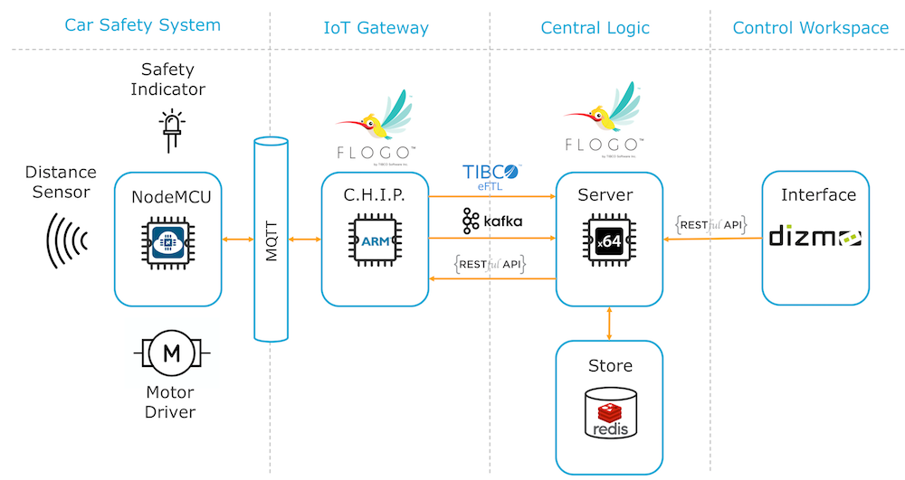

# Connected Car Demo
##Outline
I created this project to demonstrate the use of [Project Flogo](http://flogo.io) as IoT Gateway. 
The use case I had in mind was to add the advantage of having a connected car that would use central knowlegde of certain conditions on the road like fog, accidents, and sun glare to enhance the notion of the driver keeping a safe distance.
The on-board Car Safety System measures the actual distance to the car in front and determines the safety state; Too Close, Safe or Optimal. It is also capable of making the car keep optimal distance.
The IoT Gateway receives distance and safety state from the Car Safety System and passes this on to the Central Logic.
The Central Logic can also receive conditional information from the frontend GUI and pass on a related safety factor back to the IoT Gateway on the car to actually tell the car to take more distance.
I also added the idea of having a driver opt-in to share the safety factor with an insurance company, so safe drivers would potentially have to pay less premium on their car insurance. 
##Connectivity
For the communcation I used several options, just for sake of technology:

 - On-board all devices talk MQTT (Car Safety System and IoT Gateway)
 - From Car to Central I used TIBCO eFTL
 - From Car to Insurance Company I used Kafka
 - From Central to Car I used REST

##Components
The setup consists of a couple of parts:

 - The [Car Safety System](car-safety-system/) based on a NodeMCU v3.0 ESP-12 Board
 - An on-board [IoT Gateway](iot-gateway/) running Project Flogo on a [C.H.I.P. computer](https://getchip.com/pages/chip)
 - Bring it all together on a standard 4-wheel [robot car](robot-car)
 - [Central Logic](central-logic/) using Project Flogo and a Redis Keystore
 - A [Control Workspace](workspace/) based on [Dizmo](https://www.dizmo.com/)

Together this look something like this:

##Running the Demo
If you have recreated (some of) the parts above and you would want to run this demo, please find the how-to guide [here](running-the-demo/).