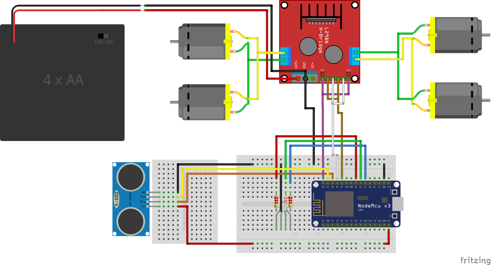
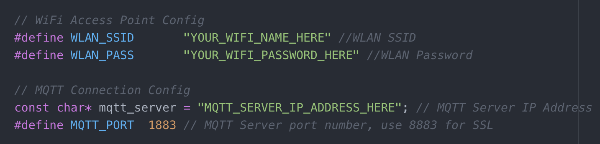
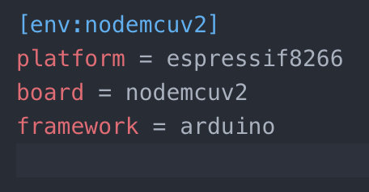

# Car Safety System
## Outline
The on-board Car Safety System measures the actual distance to the car in front and determines the safety state; Too Close, Safe or Optimal. It is also capable of making the car keep optimal distance. Optimal is constructed of a local constant muliplied by a distance factor that can change when a message with a factor is received on MQTT from the IoT Gateway. The MQTT subject is constructed from "device'" and the MAC address of the ESP-12's WiFi chip.
The basic logic flow is:

 - Read the distance from the sensor
 - Check distance against optimal distance
	 - **Optimal** (distance = optimal * distance factor, within a margin):
		 - Show **blue** LED
		 - Publish ID, distance, distState "optimal" on MQTT
	 - **Too Close** (distance < optimal * distance factor):
		 - Show **red** LED
		 - Publish ID, distance, distState "too_close" on MQTT
		 - **Move the car backwards** until distance is optimal again
	 - **Safe** (distance > optimal * distance factor):
		 - Show **green** LED
		 - Publish ID, distance, distState "safe" on MQTT
		 - **Move the car forward** until distance is optimal again
	 - Listen for any **incoming messages** and **adjust distance factor** accordingly

## Hardware Used
This is a list of the hardware I used. It has links to the exact product I bought on AliExpress, but you can of course choose what to buy where.

 - A [NodeMCU v3.0 ESP-12](https://www.aliexpress.com/item/V3-Wireless-module-NodeMcu-4M-bytes-Lua-WIFI-Internet-of-Things-development-board-based-ESP8266-esp/32647542733.html?spm=a2g0s.9042311.0.0.Nq0bHx) board 
 - A [HC-SR04](https://www.aliexpress.com/item/Free-shipping-1pcs-Ultrasonic-Module-HC-SR04-Distance-Measuring-Transducer-Sensor-for-Arduino-Samples-Best-prices/1967936408.html?spm=a2g0s.9042311.0.0.C2CePu) ultrasonic distance measuring module
 - A [L298N](https://www.aliexpress.com/item/Free-shipping-1pcs-lot-Special-promotions-2pcs-lot-L298N-motor-driver-board-module-stepper-motor-smart/1872427142.html?spm=a2g0s.9042311.0.0.7UNFIQ) motor driver board module
 - A 5mm [RGB LED](https://www.aliexpress.com/store/product/50Pcs-5mm-4pin-RGB-Tri-Color-Common-Anode-LED-Red-Green-Blue/612195_1852144523.html)
 - A [Standard breadboard](https://www.aliexpress.com/item/1pcs-DIY-400-Points-Solderless-Bread-Board-Breadboard-400-PCB-Test-Board-for-ATMEGA-PIC-Arduino/32802377725.html?spm=a2g0s.9042311.0.0.oXz7Ch) to hold the NodeMCU and the LED section.
 - A [Mini breadboard](https://www.aliexpress.com/item/free-shipping-10Pcs-Lot-Pro-Mini-Module-Atmega328-5V-16M-For-Arduino-Compatible-With-Nano/1656592084.html?spm=a2g0s.9042311.0.0.hgy8Mz) to hold the distance sensor
 - A standard 4-wheel [robot car chassis kit](https://www.aliexpress.com/item/5-colors-choose-one-color-4WD-Smart-Robot-Car-Chassis-Kits-for-arduino-with-Speed/32679090614.html?spm=a2g0s.9042311.0.0.oXz7Ch)

## Shema
This is the schema of the system as created in [Fritzing](http://fritzing.org).

The Fritzing project for this schema can be found [here](iot-car.fzz).

## Arduino Code
The source code used for the car safety system can be found [here](iot-car.ino).

I am using [PlaformIO](http://platformio.org/) as developement environment. They combine all things IoT and support many platforms. The Project Flogo team is also engaging with them for [Flogo Edge](https://www.tibco.com/blog/2017/06/23/introducing-flogo-edge-apps/). Be sure to check them out.

###Edit the configration parameters
In the code you will find a number of parameters that should match your setup:

 - In the **WiFi Access Point Config** section adjust the following:
	 - Set **WLAN_SSID** to match your WiFi network name
	 - Set **WLAN_PASS** to match yout WiFi network password
 - In the **MQTT Connection Config** section adjust the following:
	 - Set ** mqtt_server** to the IP address of the MQTT broker on the IoT Gateway
	 - Set **MQTT_PORT** to the Port number of the MQTT broker on the IoT Gateway
	 - You'll know the above values once you've setup the IoT Gateway as described in [this section](../iot-gateway/). 

The section looks like this:

When you use another board you probably need to change some pin assignments. All pin assignments are set in the same **Constants** section, below the other settings in the code as mentioned above.

### Upload the code to the NodeMCU device
When you open the source code in ProjectIO, you can choose a board for this project. For my NodeMCU ESP12 hardware this is the following:

##What's Next?
Now you can choose what to do next:

 - Start to build the [IoT Gateway](../iot-gateway/)
 - Start to put the Car Safety System on the [Robot Car](../robot-car/)
 - Test the Car Safety System by following that section of [Running the Demo](../running-the-demo/)