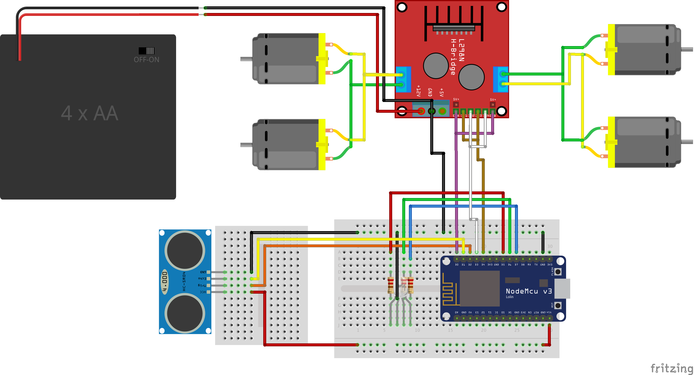

# Assembling the Robot Car

## The Basics
The standard robot car chassis has two layers. The bottom layer holds the motors in place on which the wheels can be mounted. Just follow the instructions that come with the kit you ordered. I put the 4xAA battery pack also on that layer, right behind the back wheels.

## Place the Car Safety System on the robot car

### Schematic
As described in the [Car Safety System](../car-safety-system/) section, this is the schematic of the system:
 

### Install the L298N motor driver
I put this module in the middle between the motors on the lower section of the car as well. Do the following:

 - Hook up the **power** from the 4xAA battery pack to the **+12V** connection
 - Hook up the cables from the **motors on the left** side to the **Motor A** connector in parellel
 - Hook up the cables from the **motors on the right** side to the **Motor B** connector in parellel
 - Connect a **flat cable** to the 6 pins **ENA** through **ENB**
 - Connect a **black cable** to the **GND** (share this connector with the minus cable from the battery pack)
 - The flat cable and the black cable will be run through to the top layer pf the car and connected to the main board later on

Side view:

### Install the HC-SR04 distance sensor
I put this module on a mini bread board on the front of the car on the bottom layer. Do the following:

 - Stick the mini breadboard to the bottom layer at the front of the car
 - Put the HC-SR04 on the board connect the wires on the same section of the board, of you follow my color scheme:
	 - Connect the **red** wire to the **VCC** lane
	 - Connect the **orange** wire to the **Trig** lane
	 - Connect the **yellow** wire to the **Echo** lane
	 - Connect the **black** wire to the **GND** lane
These wires will also be run through to the top layer to be connected to the main board.

View from the front:

### Install the main board
Stick the mid-size breadboard on the top layer on the front side of the car. Follow the schematic above to install:

 - Place the **NodeMCU** controller on the board
 - Place the **LED** on the board
 - Place the **resistors** on the board
 - Hook up the **LED wires** to the **NodeMCU**
 - Hook up the **L298N wires** to the **NodeMCU**
 - Hook up teh **HC-SR04 wires** to the **NodeMCU**

The installed main board:

## Place the IoT Gateway on the robot car
I got a [2-port USB Power bank](https://www.conrad.nl/nl/denver-10000-mah-powerbank-2-usb-poorten-pba-10001-1526214.html), and then put the C.H.I.P. on the top layer towards the rear of the car. This looks something like this:

## All Done!
Now the car should look like this:

## What's next?
Once you've assembled the car you can choose to do the following:

 - Create the [Demo Workspace](../workspace/)
 - [Run the demo](../running-the-demo) without the workspace