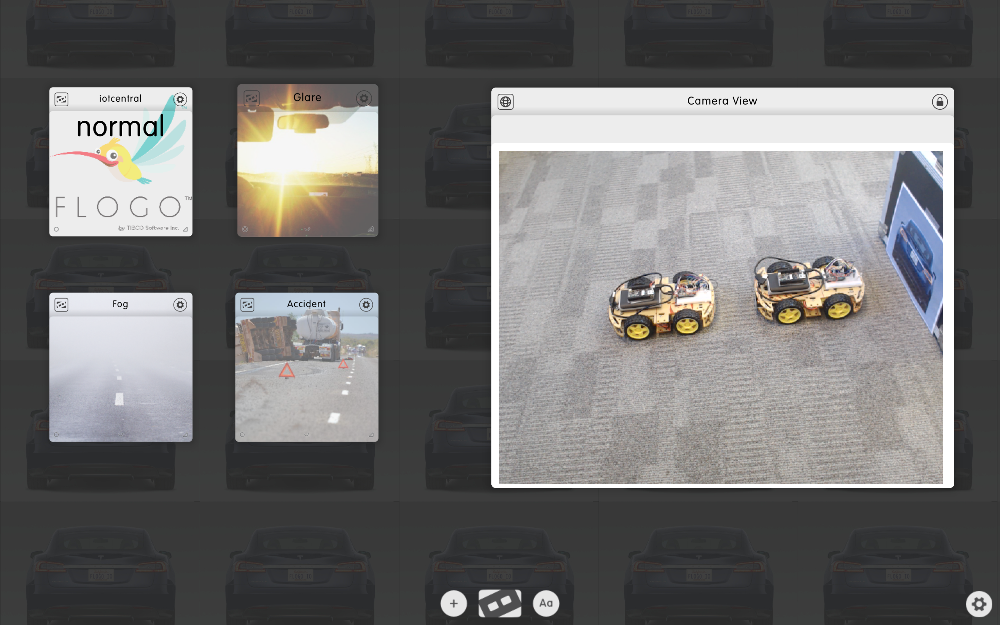

# Creating the Workspace

## Outline
In order to showcase the demo I wanted to have use a control workspace that would be easy to use but also easy for the audience to grasp the whole concept in one view.

This is why I chose [Dizmo](https://www.dizmo.com/) as the tool of choice. Dizmo provides a scalable workspace that presents a set of digital gizmos (dizmos) that each perform a specific function. These dizmos can also interact with each other and exchange data.

What I wanted to create was a control workspace that would:

* Show a set of possible road conditions:
	* Normal
	* Accident
	* Fog
	* Sun Glare
* Have a means to communicatie the road condition to the [central logic](../central-logic) created in Flogo.
* Show a video stream from a camera that shows the movement of the car(s) as a result of introducing a different road condition.

## Interaction
The way I wanted to work with the control workspace is as follows:

* A newly created **IoT Central** dizmo that will sit in the middle, accept a new condition, and then call the REST api hosted by the central logic.
* An newly created **IoT Condition** dizmo that represents a configurable condition.
* Dizmo has a mechanism called **docking** that allows data to be exchanged between dizmo's when they are dragged towards each other.
* When a IoT Condition dizmo is docked to the IoT Central dizmo a preconfigured value should be passed the IoT Central as a new condition
* The existing **Tiny Browser** dizmo will just sit on the workspace tho show the live video feed from the camera.

## Create the Dizmo Workspace
This section provides a step-by-step instruction on how to (re)create the workspace.

### Get the Dizmo Viewer
The Dizmo workspace is hosted using the Dizmo Viewer. To get it:

* Register with Dizmo [here](https://openid.dizmo.com/account/register.html). When they contact you, tell them I sent you. They will love us all :)
* Login at Dizmo with your new dizmoID [here](https://openid.dizmo.com/login/?openid.return_to=https%3A%2F%2Fwww.dizmo.com%2Fwp-login.php%3FSOCIALID%3DdeLoginByDizmo_check%26redirect_to%3Dhttps%253A%252F%252Fwww.dizmo.com&openid.mode=checkid_setup&openid.identity=https%3A%2F%2Fopenid.dizmo.com%2F&openid.trust_root=https%3A%2F%2Fwww.dizmo.com&openid.sreg.required=email&openid.sreg.optional=dob,gender,postcode,country,language,timezone).
* Download the Dizmo Viewer [here](https://www.dizmo.com/download/).
* Install and run the Dizmo Viewer
* Upon startup use your Dizmo dizmoID to login to the viewer

### Download the custom Dizmos

Download the IotCentral Dizmo <a href="iotcentral-0.0.0.dzm" download="iotcentral-0.0.0.dzm">here</a>

Download the IotCondition Dizmo <a href="iotcondition-0.0.0.dzm" download="iotcondition-0.0.0.dzm">here</a>

Download the images for 
<a href="glare.jpg" download="glare.jpg">**glare**</a>, 
<a href="fog.jpg" download="fog.jpg">**fog**</a> and
<a href="accident.jpg" download="accident.jpg">**accident**</a> 

### Prepare the Video
In this section we'll setup the webcam and host the stream on a small local http server. This needs to be done, because browser do not accept direct video feeds from a file based URL. Here's what to do.

* Copy all files in the [**video section**](video/) to your local file system
* Make sure you have **Python** installed
* Open a terminal and go to the directory where you stored the video files just now
* Run the following command:

`python -m SimpleHTTPServer 9090`

### Add Dizmos to empty workspace
Follow these step to put it all together:

* Clear the workspace - Click the **Settings** icon on the bottom left and select **Clear** 
* Add the **IoT Central** dizmo to the workspace
	* Drag the download **iotcentral-000.dzm** file onto the workspace
	* Click on the dizmo's settings (either by pressing the small **flip** icon in the lower middle section in the dizmo, or by pressing the top-right settings icon and select **settings**)
	* Change the Endpoint URL to match your central logic Flogo apps REST endpoint.
	* Press <kbd>Done</kbd>
* Add 3 **IoT Condition** dizmos to the workspace
	* Drag the download **iotcondition-000.dzm** file onto the workspace
	* Goto the dizmo's settings
	* Fill in condition **glare**
	* Press the dizmo's **settings** icon and select **Background image**
	* Select downloaed **glare.jpg**
	* Press <kbd>Done</kbd>
	* Repeat the above 6 steps for **fog** and **accident**
* Add a **Tiny Browser** dizmo to the workspace
	* Press the **+** icon on the mid-lower section of the workspace to make the creator dizmo visible
	* In the search area type **tiny**
	* Select **Tiny Browser** from the list
	* In the address bar of the browser type **http://localhost:9090/webcam.html**
	* Change the title of the browser dizmo
		* Goto the dizmo's **Settings**->**Title**
		* Change the name to **Camera View**
	* Hide the address bar of the browser dizmo
		* First make sure the dizmo is of the right size and in the right place
		* Goto the dizmo's **Settings**
		* Select **Lock**

## All Done!
The finished workspace should look something like this:

## What's next?
This is all that needs to be done on the preparations.
Now you can start to [Run the Demo](../running-the-demo)!	

